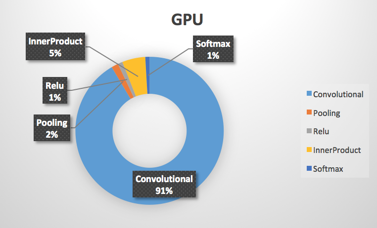
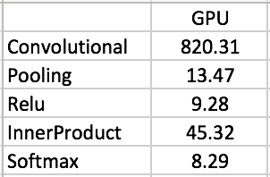
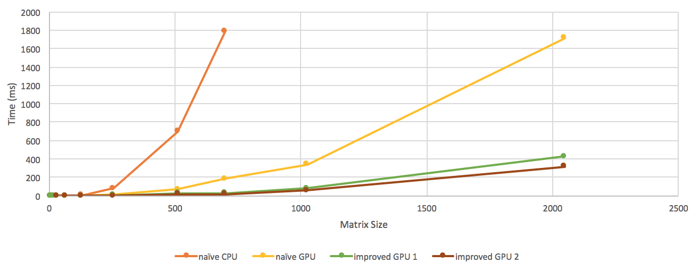
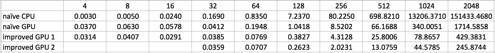
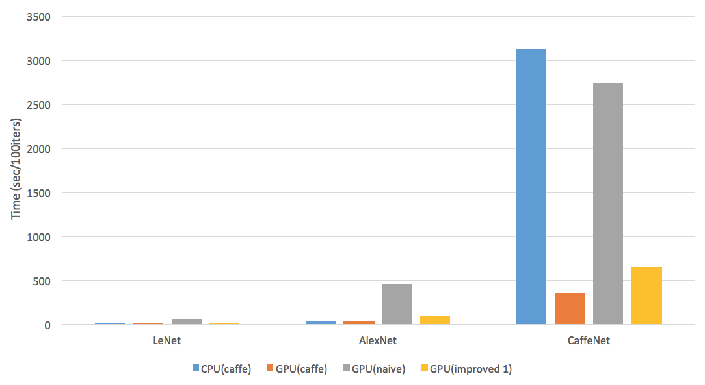
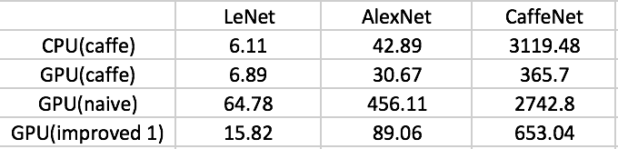

GPU-Accelerated-Deep-CNN-for-Object-Recognition
======================

**University of Pennsylvania, CIS 565: GPU Programming and Architecture, Final Project**

* Guan Sun
* Tested on: Mac OS X Yosemite 10.10.5, Intel Core i7 @ 2.3GHz 8GB, GeForce GT 650M 1024MB (Personal Laptop)

## Project Description:
In this project, the computation of serveral neural network layers are implemented using CUDA under the caffe framework. Then a 10-class object recognition neural network model, which is composed of the implemented layers, is trained using the cifar-10 dataset. The model achieved a recognition accuracy of 76.21%.

The layers whose computation is implemented include,
* Convolutional Layer
* Pooling Layer
* Inner Product Layer
* Rectified Linear Unit Layer
* Softmax Layer

## Performance Analysis:

### Time Distribution

### Matrix Multiplication Optimizition

### Performance of Different Implementations with Different Nets and Dataset

## Running the code

### Install caffe
To install a caffe that contains my implementation, please download the caffe folder in this repo. Then follow the installation instructions here: http://caffe.berkeleyvision.org/installation.html

### Test my implementation
My implementations for the layers' computation can be tested using google unit test.
To test the matrix multiplication, use command build/test/test_all.testbin --gtest_filter='*Gemm*'
To test the convolutional layer, use command build/test/test_all.testbin --gtest_filter='*Convolution*'
To test the pooling layer, use command build/test/test_all.testbin --gtest_filter='*Pooling*'
To test the inner product layer, use command build/test/test_all.testbin --gtest_filter='*Product*'
To test the rectified linear unit layer, use command build/test/test_all.testbin --gtest_filter='*Pooling*'
To test the softmax layer, use command build/test/test_all.testbin --gtest_filter='*Softmax*'

### Train & Test a neural network model
Run ./data/cifar10/get_cifar10.sh
Run ./examples/cifar10/create_cifar10.sh
Run ./examples/cifar10/train_quick.sh
Then the training should start, all the nessasary information will be printed in the terminal.

### Compare matrix multiplication performance
Download the MatrixMultiplicationTest folder, it is a Nsight Ecllipse project that contains different matrix multiplication implementations. Compile and run, the timing information will be displayed at the console.

## References
* http://caffe.berkeleyvision.org/
* http://ufldl.stanford.edu/tutorial/supervised/ConvolutionalNeuralNetwork/
* http://devblogs.nvidia.com/parallelforall/using-shared-memory-cuda-cc/
* Upenn CIS565 lecture slides by Patrick Cozzi

