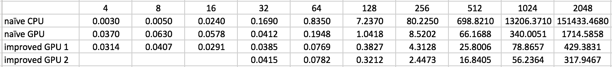

GPU-Accelerated-Deep-CNN-for-Object-Recognition
======================

**University of Pennsylvania, CIS 565: GPU Programming and Architecture, Final Project**

* Guan Sun
* Tested on: Mac OS X Yosemite 10.10.5, Intel Core i7 @ 2.3GHz 8GB, GeForce GT 650M 1024MB (Personal Laptop)

## Project Description:
In this project, the computation of serveral neural network layers are implemented using CUDA under the caffe framework. Then a 10-class object recognition neural network model, which is composed of the implemented layers, is trained using the cifar-10 dataset. The model achieved a recognition accuracy of 76.21%.

<div style="text-align:center" markdown="1">

</div>

Features implemented include,
* Convolutional Layer Computation     
	Basically matrix-matrix multiplication and matrix-vector multiplication. The implemented CUDA kernal functions are in math_functions.cu file
* Pooling Layer Computation     
	Average pooling and max pooling are implemented. The CUDA kernal functions are in pooling_layer.cu file.
* Inner Product Layer Computation     
	The inner product computation is implemented as matrix multiplication, uses the same CUDA kernal functions in math_funcitons.cu as the convolutional layer.
* Rectified Linear Unit Layer Computation     
	A simple non-linear function, the CUDA kernal is in relu_layer.cu file.
* Softmax Layer Computation     
	The softmax function for classification is implemented. The CUDA kernal functions are in softmax_layer.cu file.

## Performance Analysis:

### Time Distribution


The figure shows the computational time distribution for all kinds of layers in the network. Most of the time(96%) is spent on the convolutional layers and inner product layers, both of which are implemented using matrix multiplication. The table shows the exact time(in ms) spent on each kind of layers in one training iteration.      
From this result, I decided to focus on optimizing the matrix multiplication to achieve better overall network performance.   

### Matrix Multiplication Optimizition




The figure above shows the comparison of a naive CPU and serveral different GPU matrix multiplication's performance with regard to matrix size. The CPU computational time increases dramatically as the size increase. The naive GPU implementation would also be slow when the matrix gets large since it access the global memory for each element and that will take lots of GPU memeory bandwith.      
The first improvement I tried was to use the shared memory on GPU, this method basically divide the matrices into blocks, the threads within each block can share the elements in the block using shared memory. Thus the bandwith need is reduced and the thread can access elements faster. This method is about 4 time faster than the naive one.    
The second improvement is based on the first one, this method also do the computation based on blocks but the block now is a rectangle composed of two blocks in the previous method, thus one thread could compute two elements in the result matrix. This method needs larger shared memory for each block and each thread will be slower, but the number of threads reduced to half. This method is about 30% faster than the previous one. However, I didn't get this work untill very close to the deadline, so don't have enough time to integrate it with caffe and test the performance.   
The table below the figure shows the exact time (in ms) of each computation.   

### Performance of Different Implementations with Different Nets and Dataset


This figure shows the computational time of different caffe implementations when doing 100 iteration training. The net gets more and more complex from left to right, and the training data also becomes larger(higer resolution images, more colorful, etc).    
If we look at the original caffe CPU and GPU implementation, it can be seen that as the networks computation becomes more intense, the GPU performance becomes more and more attractive(GPU could be 8.5 times faster).     
The two implementation of mine are slower than the original caffe. The improved version is about 2 times slower. But it is still much faster than the CPU version when the data set gets large.
If I could plug in the other better matrix multiplication optimization method, the performance should be really close to the original GPU version.    


## Running the code

### Install caffe
To install a caffe that contains my implementation, please download the caffe folder in this repo. Then follow the installation instructions here: http://caffe.berkeleyvision.org/installation.html

### Test my implementation
My implementations for the layers' computation can be tested using google unit test.   
To test the matrix multiplication, use command
Run 
```{r, engine='bash', count_lines}
build/test/test_all.testbin --gtest_filter='*Gemm*' 
```    
To test the convolutional layer, use command 
```{r, engine='bash', count_lines}
build/test/test_all.testbin --gtest_filter='*Convolution*'   
```    
To test the pooling layer, use command 
```{r, engine='bash', count_lines}
build/test/test_all.testbin --gtest_filter='*Pooling*'
```     
To test the inner product layer, use command 
```{r, engine='bash', count_lines}
build/test/test_all.testbin --gtest_filter='*Product*'
```   
To test the rectified linear unit layer, use command
```{r, engine='bash', count_lines}
build/test/test_all.testbin --gtest_filter='*Pooling*'   
```   
To test the softmax layer, use command
```{r, engine='bash', count_lines}
build/test/test_all.testbin --gtest_filter='*Softmax*'
```    

### Train & Test a neural network model
Run 
```{r, engine='bash', count_lines}
./data/cifar10/get_cifar10.sh
```   
Run 
```{r, engine='bash', count_lines}
./examples/cifar10/create_cifar10.sh 
```   
Run 
```{r, engine='bash', count_lines}
./examples/cifar10/train_quick.sh
``` 
Then the training should start, all the nessasary information will be printed in the terminal.  

### Compare matrix multiplication performance
Download the MatrixMultiplicationTest folder, it is a Nsight Ecllipse project that contains different matrix multiplication implementations. Compile and run, the timing information will be displayed at the console.  

## References
* http://caffe.berkeleyvision.org/
* http://ufldl.stanford.edu/tutorial/supervised/ConvolutionalNeuralNetwork/
* http://devblogs.nvidia.com/parallelforall/using-shared-memory-cuda-cc/
* Upenn CIS565 lecture slides by Patrick Cozzi


